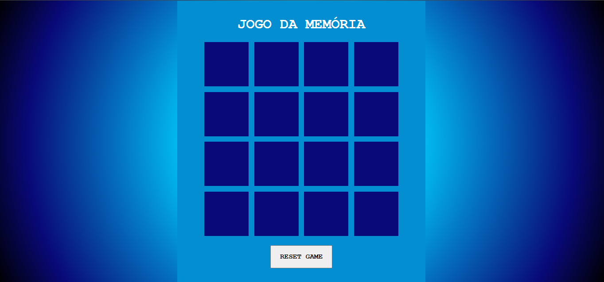

# JS Game Jogo da Memória

## Tecnologias Utilizadas:
  - HTML5
  - CSS3
  - JavaScript

## Como Jogar:
  - Abra o jogo clicando [aqui](https://nataliabrunelli.github.io/jogo-da-memoria/);
  - Ache os pares de cartas;
  - Reinicie o jogo clicando no botão "RESET GAME".

---

